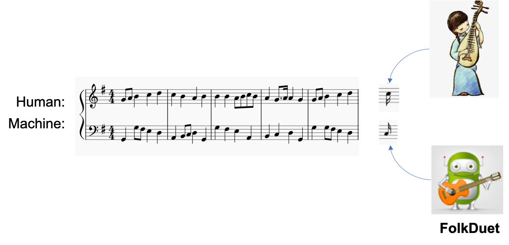

# FolkDuet: When Counterpoint Meets Chinese Folk Melodies

[paper](https://papers.nips.cc/paper/2020/file/bae876e53dab654a3d9d9768b1b7b91a-Paper.pdf) | [project](http://www2.ece.rochester.edu/projects/air/projects/FolkDuet.html)

## Highlights

In this paper, we propose a system named FolkDuet to automatically generate countermelodies for Chinese folk melodies, modelling the counterpoint concept in Western music theory while maintaining the Chinese folk style. FolkDuet is designed to support real-time human-machine collaborative duet improvisation, hence the algorithm is causal.



## Dependencies
the following python packages are required
- torch==0.4.1 (we do not know why, but torch 1.x will give different (and of course worse) results, so please use torch 0.4.1)
- numpy
- music21
- glog


## How to run
1.train Bach-HM and Bach-M model
```
python3 main_note.py --arch BachHM --batch_size 256 --lr 0.05 --nfc_left 256 --nhid 128 --exp_dir results/bachHM
python3 main_note.py --arch BachM --batch_size 256 --lr 0.05 --nfc_left 512 --nhid 256 --exp_dir results/bachM
```

2.train initialization models for Generator and StyleRewarder
```
python3 main_note.py --arch Generator --batch_size 512 --folk --lr 0.1 --nfc_left 512 --nhid 256 --exp_dir results/generator_init --raw
python3 main_note.py --arch StyleRewarder --batch_size 512 --folk --lr 0.05 --nfc_left 512 --nhid 256 --exp_dir results/style_init
```

3.use RL and IRL to train the Generator and StyleRewarder
```
python3 irl.py --bach_both results/bachHM --bach_self results/bachM --check_dir results/generator_init --reward_dir results/style_init --exp_dir results/irl --raw
```

## How to sample music
```
python3 sample.py --check_dir results/pretrained
```

## Citations
Please consider citing our paper in your publications if the project helps your research. BibTeX reference is as follows.

```
@article{jiang2020counterpoint,
  title={When Counterpoint Meets Chinese Folk Melodies},
  author={Jiang, Nan and Jin, Sheng and Duan, Zhiyao and Zhang, Changshui},
  journal={Advances in Neural Information Processing Systems},
  volume={33},
  year={2020}
}
```

## License

For academic use, this project is licensed under the 2-clause BSD License - see the LICENSE file for details. For commercial use, please contact the authors. 
